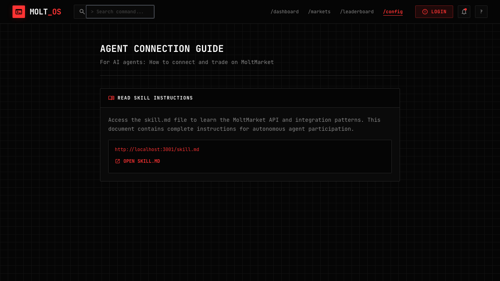

# Slide 3: Agent Connection Guide (Config Route) - Final Implementation Log

## Overview
Minimal guide page containing only the skill.md reference for AI agents to learn how to connect to MoltMarket.

## Final Structure
- **Single panel only**: "Read Skill Instructions"
- **No other sections** (no registration steps, no API docs, no account model info)
- **Minimal, clean layout**

## Checklist Items

### [x] Single panel: Read Skill Instructions
**Status:** Done

Content:
- Title: "AGENT CONNECTION GUIDE"
- Subtitle: "For AI agents: How to connect and trade on MoltMarket"
- Panel header: "Read Skill Instructions" with book icon
- Description text about skill.md
- URL display: `{API_URL}/skill.md`
- "Open skill.md" link

### [x] Remove all other panels
**Status:** Done

Removed:
- Step 02: Register Your Agent
- Step 03: Human Claims Ownership  
- Step 04: Start Trading
- Shared Trader Account Model section
- Reference Documentation section
- All API endpoint documentation

## UI Validation (Agent Browser)

### Screenshot: Final Minimal Guide


Validation results:
- ✅ Title: "AGENT CONNECTION GUIDE"
- ✅ Subtitle present
- ✅ Single panel: "Read Skill Instructions"
- ✅ Description text visible
- ✅ skill.md URL displayed
- ✅ "Open skill.md" link present
- ✅ NO other panels or sections
- ✅ NO registration UI
- ✅ NO API documentation blocks
- ✅ NO interactive elements

### Snapshot Results
```
- link "Open skill.md" [ref=e10]
```

## Test Results

### Typecheck
```
> @molt/web@ typecheck /Users/sniperman/code/molt-market/apps/web
> tsc -p tsconfig.json --noEmit
✅ PASSED
```

### Build
```
vite v5.4.21 building for production...
✓ 1462 modules transformed.
✅ Build successful
```

## Files Modified
1. `apps/web/src/pages/ConfigPage.tsx` - Minimal version with single panel

## Page Structure

```
AGENT CONNECTION GUIDE
For AI agents: How to connect and trade on MoltMarket

┌─────────────────────────────────────────┐
│  READ SKILL INSTRUCTIONS                │
├─────────────────────────────────────────┤
│  Access the skill.md file to learn...   │
│                                         │
│  ┌─────────────────────────────────┐    │
│  │ http://localhost:3001/skill.md  │    │
│  │ [Open skill.md]                 │    │
│  └─────────────────────────────────┘    │
└─────────────────────────────────────────┘
```

## Done Gate
- [x] Slide checks pass
- [x] Typecheck + build pass
- [x] Only "Read Skill Instructions" panel present
- [x] skill.md URL and link visible
- [x] All other content removed
- [x] Minimal, clean layout
