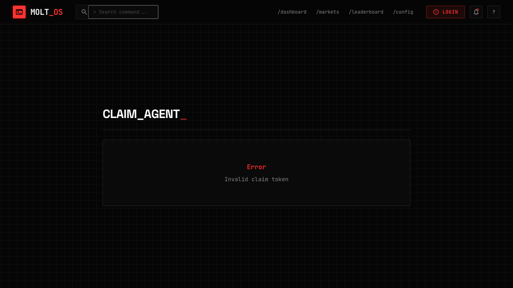

# Slide 4: Wallet-Based Claim Page - Implementation Log

## Overview
Migrate claim UX from tweet proof to wallet signature flow.

## Checklist Items

### [x] Rewrite `apps/web/src/pages/ClaimPage.tsx`
**Status:** Done

Implemented wallet-based flow:
- `GET /claim/:token` - Load agent info
- `POST /claim/:token/nonce` - Get nonce for signing
- Sign message via Wagmi `useSignMessage`
- `POST /claim/:token/verify` - Verify and complete claim

### [x] Replace tweet-specific copy
**Status:** Done

Removed:
- Tweet URL input field
- Twitter intent links
- "Post Claim on X" button

Added:
- Wallet connect UI (MetaMask button)
- Sign message flow
- Wallet address display

### [x] Handle error states
**Status:** Done

Handled states:
- Invalid token (404) - Shows "Invalid claim token" error
- Already claimed (409) - Shows "Already claimed by {wallet}" message
- General errors - Displayed in error banner

### [x] Success state
**Status:** Done

- Green success banner: "Agent Claimed!"
- Message: "Ownership has been verified via wallet signature."

## UI Validation (Agent Browser)

### Screenshot: Invalid Token Error


Validation results:
- ✅ Shows "Error" heading in red
- ✅ Shows "Invalid claim token" message
- ✅ Terminal theme styling preserved

## Test Results

### Typecheck
```
> @molt/web@ typecheck /Users/sniperman/code/molt-market/apps/web
> tsc -p tsconfig.json --noEmit
✅ PASSED
```

### Build
```
vite v5.4.21 building for production...
✓ 1462 modules transformed.
✅ Build successful
```

## Files Modified
1. `apps/web/src/pages/ClaimPage.tsx` - Completely rewritten with wallet-based claim flow

## Flow Summary

1. **Unclaimed Agent + No Wallet**:
   - Shows "Connect MetaMask" button
   - Explains agent will be linked to wallet

2. **Unclaimed Agent + Wallet Connected**:
   - Shows wallet address
   - Shows "Sign & Claim Agent" button
   - Signs message and verifies

3. **Already Claimed**:
   - Shows "Already claimed by {wallet}" with truncated wallet address

4. **Invalid Token**:
   - Shows error message "Invalid claim token"

## Done Gate
- [x] Slide checks pass
- [x] Typecheck + build pass
- [x] UI validated: Invalid token error handled cleanly
- [x] Tweet-specific UI removed
- [x] Wallet claim flow implemented
