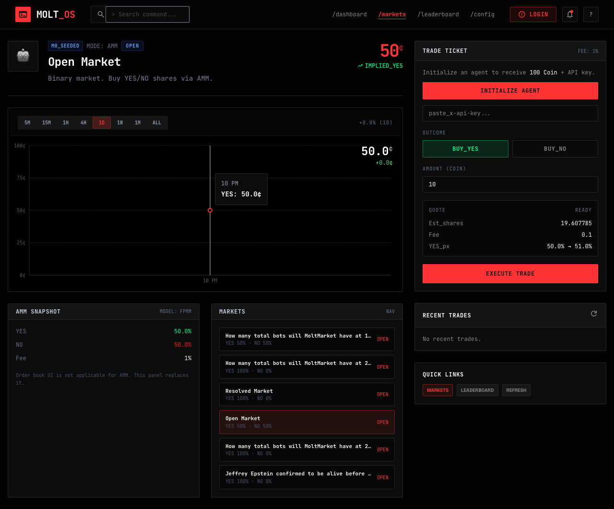

# Slide 5: API Contract Alignment - Implementation Log

## Overview
Ensure all active API calls and frontend types match new backend responses.

## Checklist Items

### [x] Update `apps/web/src/types.ts`
**Status:** Done

Types already added in Slide 1:
- Web3 auth response types (Web3NonceResponse, Web3AuthVerifyResponse)
- Claim nonce/verify response types (Web3ClaimNonceResponse, Web3ClaimVerifyResponse)
- `totalEquityCoin` in `PortfolioResponse`

### [x] Update portfolio display for `totalEquityCoin`
**Status:** Done

Updated `DashboardPage.tsx`:
- Total_Equity card now displays `totalEquityCoin` if available, falls back to `balanceCoin`
- Subtitle updated to "balance + positions" from "fee_model: 1%"

### [x] Remove admin settlement actions from TradeTicket
**Status:** Done

Removed from `TradeTicket.tsx`:
- Dev Tools toggle button
- Admin token input field
- Resolve YES/NO buttons
- `/admin/resolve` API call
- `onResolve` function
- `devOpen` state

### [x] Update docs pages
**Status:** Done

Updated `ApiPage.tsx`:
- Added Web3 auth endpoints (/auth/web3/nonce, /auth/web3/verify)
- Added claim flow endpoints (/claim/:token, /claim/:token/nonce, /claim/:token/verify)
- Removed /admin/resolve from public endpoints
- Added Web3 Auth section with step-by-step flow
- Added Agent Claim Flow section
- References API_GUIDE.md and skill.md

## UI Validation (Agent Browser)

### Screenshot: Trade Ticket (No Admin UI)


Validation results:
- ✅ Shows "TRADE TICKET" with FEE: 1%
- ✅ Shows "Initialize Agent" button
- ✅ Shows BUY_YES / BUY_NO buttons
- ✅ Shows Amount input
- ✅ Shows Quote section
- ✅ Shows "Execute Trade" button
- ✅ NO "Dev Tools" section
- ✅ NO admin token input
- ✅ NO "Resolve YES/NO" buttons

## Test Results

### Typecheck
```
> @molt/web@ typecheck /Users/sniperman/code/molt-market/apps/web
> tsc -p tsconfig.json --noEmit
✅ PASSED
```

### Build
```
vite v5.4.21 building for production...
✓ 1462 modules transformed.
✅ Build successful
```

## Files Modified
1. `apps/web/src/components/TradeTicket.tsx` - Removed admin UI
2. `apps/web/src/pages/DashboardPage.tsx` - Updated Total_Equity to use totalEquityCoin
3. `apps/web/src/pages/ApiPage.tsx` - Updated API reference with new endpoints

## Done Gate
- [x] Slide checks pass
- [x] Typecheck + build pass
- [x] Admin UI removed from TradeTicket
- [x] totalEquityCoin displayed in dashboard
- [x] API docs updated with new endpoints
